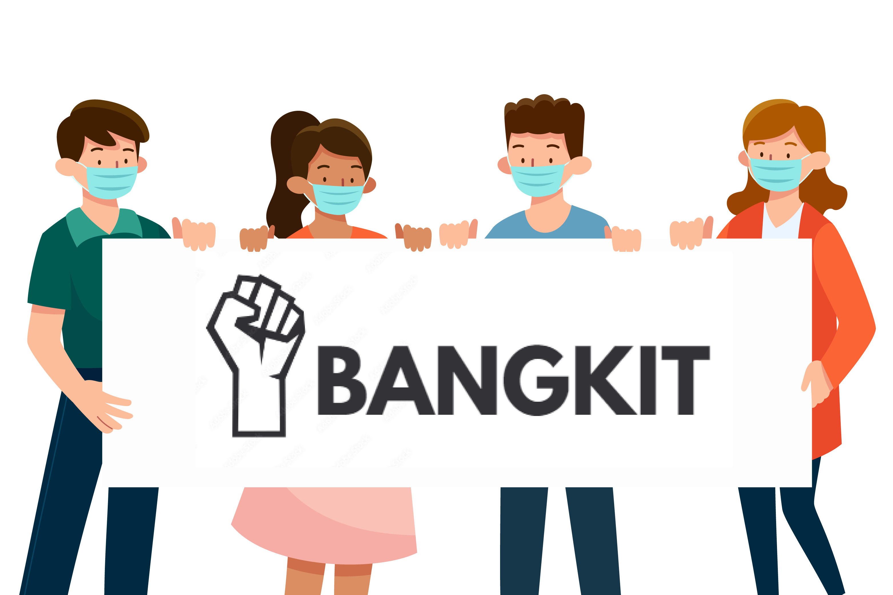

# Final Project!

##### Link Website : https://bangkit-corp.netlify.app/

### Nama Proyek: 
#### Bangkit: Aplikasi Pelaporan Masalah dan Penyediaan Informasi bagi Masyarakat Indonesia yang Terdampak Covid-19

### Deskripsi Proyek:
#### Bangkit adalah suatu platform aplikasi website yang bertujuan untuk menghubungkan masyarakat umum yang terdampak pandemi dari sektor ekonomi, kesehatan dan pendidikan dengan instansi atau perusahaan atau pemerintah yang menyediakan bantuan atau solusi dari adanya permasalahan-permasalahan yang muncul akibat pandemi.

### Metode Pembuatan:
#### Aplikasi Bangkit dibuat menggunakan metode Design Thinking.

### Target Pengguna:
-   Gender : Semua
-   Age range :
-   Pelajar
-   Dewasa
-   Geographical range : Indonesia
-   Occupation : Masyarakat umum dan Pelajar
-   Habits & Behavior :
-   Untuk masyarakat umum yang terdampak covid 19, khususnya:
-   Pekerja yang tidak memiliki pekerjaan karena di PHK atau terdampak covid 19.
-   Pelajar yang putus sekolah karena tidak dapat membayar biaya sekolah, membeli gadget dan kuota untuk mengikuti pembelajaran daring.
-   Masyarakat umum yang kesulitan mendapatkan bantuan kesehatan berupa: obat-obatan, masker, dan tabung oksigen.
-   Masyarakat umum yang ingin melihat perkembangan terbaru covid-19.
-   Untuk instansi yang ingin ikut andil dalam pemulihan dampak pandemi covid-19 di Indonesia.
-   Pemerintah
-   Swasta
-   LSM

### Solusi & Fitur yang ditawarkan
1.  Pelaporan Masalah
    

User dapat melaporkan masalahnya dari berbagai sektor masalah, mulai dari ekonomi, pendidikan, dan kesehatan.

Bantuan dapat datang dari berbagai elemen masyarakat, mulai dari masyarakat biasa, instansi (pemerintah, swasta, dan LSM). Solusi ini menekankan pada kolaborasi tanpa batas. Setelah user melaporkan masalahnya, user dapat berdiskusi layaknya sebuah forum, hingga menemukan seorang donatur dari user lain ataupun instansi.

2.  Penyediaan Informasi
User akan disajikan informasi yang bersumber dari instansi (pemerintah, swasta, LSM), informasi yang disajikan akan terbagi menjadi 3 sektor masalah, mulai dari ekonomi, pendidikan, dan kesehatan.
	1.  Lowongan Pekerjaan
	2.  Beasiswa Pendidikan
	3.  Artikel Kesehatan
Pendekatan solusi yang menekankan pada pilihan (user dapat memilih sendiri solusi apa yang terbaik untuknya) dan kecepatan (user bisa memperoleh solusi lebih cepat dan dengan waktu yang terukur)

### Visi & Misi Bangkit
#### Visi

Visi Bangkit adalah menjadi solusi digital inovatif untuk mengatasi permasalahan yang diakibatkan oleh dampak pandemi covid-19 di Indonesia

  

#### Misi

Menghadirkan fitur yang dapat menjawab permasalahan masyarakat dari berbagai sektor masalah: ekonomi, pendidikan, dan kesehatan.

Bangkit memiliki misi untuk menghadirkan 2 solusi utama, yaitu pelaporan masalah yang merupakan solusi yang menekankan kolaborasi tanpa batas dimana pengguna dapat melaporkan masalahnya dan pengguna lain maupun instansi dapat membantu menyelesaikan masalah tersebut dan penyediaan informasi yang menyajikan informasi lowongan pekerjaan, beasiswa, dan artikel kesehatan yang bermanfaat bagi masyarakat Indonesia untuk dapat kembali pulih dari dampak pandemi covid-19.